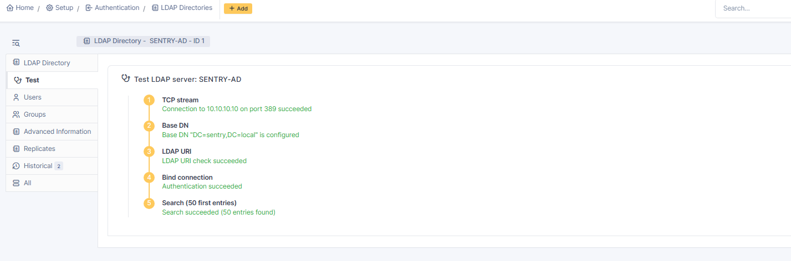
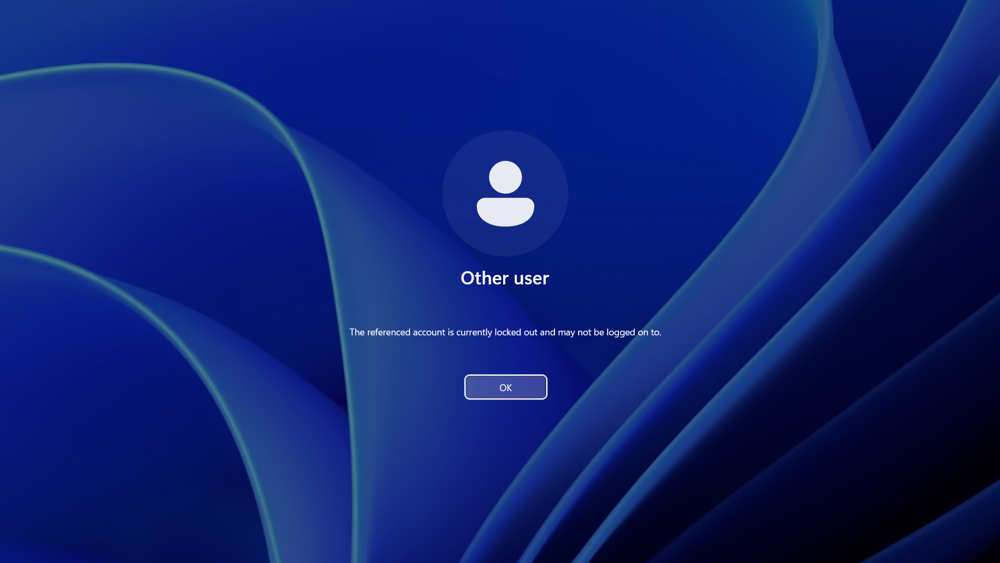
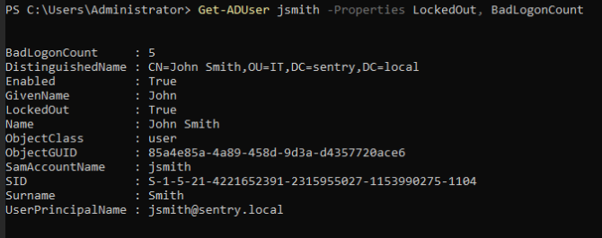
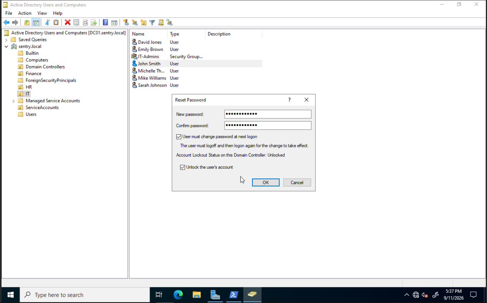
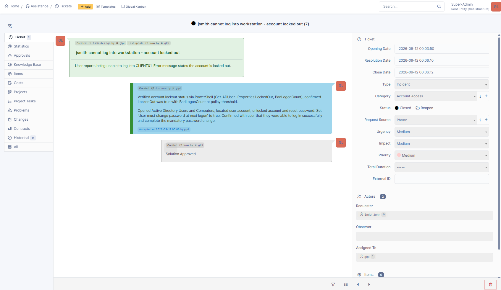

# IT Service Desk Lab - GLPI + Active Directory 

A self-hosted service desk lab built to simulate Tier 1 IT support workflows using GLPI, Active Directory, and a Proxmox-hosted Linux environment. The project demonstrates ticket intake and triage, prioritization, troubleshooting, escalation, account support, resolution documentation, and knowledge-base development. 

## Environment 
- **ITSM Platform:** GLPI 11.0.8
- **Virtualization:** Proxmox VE
- **Host:** Debian 12 LXC container on Proxmox VE
- **Backend:** Apache 2.4, MariaDB 10.11, PHP 8.2
- **Directory Services:** Microsoft Active Directory 
- **Directory Integration:** LDAP
- **Support Structure:** Tier 1 Help Desk, Tier 2 Desktio, Network Team
- **Deployment:** Self-hosted on existing home lab infrastructure

Before installing GLPI, I validated the environment against its requirements, catching and resolving a missing PHP extension before proceeding:

*Initial environment check flagged a missing PHP bcmath extension, required for QR code support.*

*Installed php-bcmath and re-ran the check. All required, security, and suggested checks now passing.*

## What I built

- Integrated GLPI with my Microsoft Active Directory environment through LDAP to provide real-world scenarios and to support realistic service desk workflows using live directory infrastructure. 
- Deployed GLPI from source on a purpose-built LXC container, configuring Apache, MariaDB, required PHP extensions.
- Hardened the installation by securing the MariaDB root account, removing default database access, and changing all default GLPI account passwords.

*Fresh GLPI install with demonstration data disabled; clean baseline before populating sample ticket data.*

- Configure six service desk ticket categories reflecting common help desk request types: Account Access, Hardware, Software, Network/Connectivity, Printer, and Onboarding/Offboarding.

*Ticket categories configured to reflect common help desk request types.*

- Created and worked service desk tickets across multiple categories and priority levels, documenting the troubleshooting steps, findings, user communications, and final resolutions.

*Sample resolved ticket showing identity verification, root cause diagnosis, and remediation steps documented for the user.*

*Full ticket queue showing a realistic mix of statuses, one new, one in progress, three resolved, across: account access, hardware, network, and printer categories.* 

- Built a Tier 1 / Tier 2 Desktop / Network Team group structure and demonstrated proper escalation by diagnosing and ruling out local causes before handing off an issue outside Tier 1 scope. 

*Escalation scenario demonstrating Tier 1 scope - diagnosed and ruled out local causes before escalating to the Network Team for upstream investigation.*

- Authored knowledge base articles documenting repeatable resolution procedures for common service desk issues handled in the ticketing system. 

*Knowledge base articles written to document standard resolution procedures for common ticket types; supports faster, consistent troubleshooting.*

*Example KB article. Step-by-step procedure written to standardize resolution of a common ticket type.*

- Created requester accounts and support roles in GLPI

*user accounts configured. Default system accounts were secured and sample requester profiles created to support realistic ticket scenarios.*

## Service Desk Workflow

User Request -> Ticket Creation -> Categorization and Prioritization -> Troubleshooting -> Resolution or Escalation -> Documentation -> Ticket Closure

## Service Desk Workflow

User Request → Ticket Creation → Categorization & Prioritization → Troubleshooting → Resolution or Escalation → Documentation → Ticket Closure

## Active-Directory Integration 

To go beyond a fully simulated environment, I connected the GLPI instance to a live Active Directory domain from my home lab via LDAP, and worked one ticket end-to-end using real infrastructure rather than fictional data: 

- Bridged the GLPI container onto the lab's Active Directory network and established a working LDAP connection to the domain controller.

*Live LDAP connection between GLPI and the Active Directory domain controller.*

-  Triggered a genuine account lockout on a domain-joined Windows client by exceeding the real lockout policy threshold.

*Genuine account lockout triggered on a real domain-joined client.*

- Diagnosed the lockout using PowerShell against the actual domain.

- Resolved it through Active Directory Users and Computers by unlocking the account, resetting the password, and forcing a password change at next logon.

*Password reset and unlock performed together in Active Directory Users and Computers.*

- Confirmed the fix by logging in as the affected user and completing the password change. 

*The corresponding GLPI ticket, documented and closed based on real actions taken - not a scripted scenario.*

## Skills Demonstrated 

- **Systems administration:** Deployed and configured a Linux server (Apache, MariaDB, PHP) from scratch on a virtualized platform.
- **ITSM platform administration:** Configured GLPI end-to-end; categories, user accounts, permissions, and knowledge base structure.
- **Active Directory / LDAP:** Integrated GLPI with Microsoft Active Directory through LDAP and validated directory connectivity using live lab infrastructure. 
- **Incident triage and escalation:** Performed Tier 1 troubleshooting, documented the findings, and escalated issues outside Tier 1 scope to the appropriate group. 
- **Knowledge management:** Created reusable knowledge-base articles documenting repeatable troubleshooting and resolution procedures for common service desk issues.
- **Security hygiene:** Identified and remediated default credentials across database and application accounts before considering the deployment complete.
- **Technical documentation:** Wrote clear, structured resolution notes and knowledge base articles modeling correct procedure for common help desk request types.
-  **IT support process knowledge:** Applied structured support procedures for account lockouts, hardware triage, and onboarding workflows in ticket scenarios.
