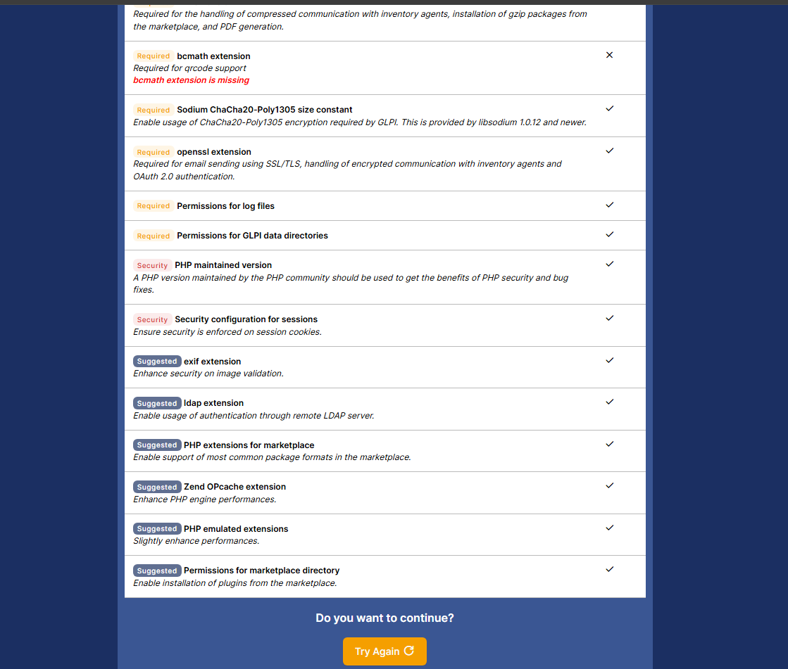
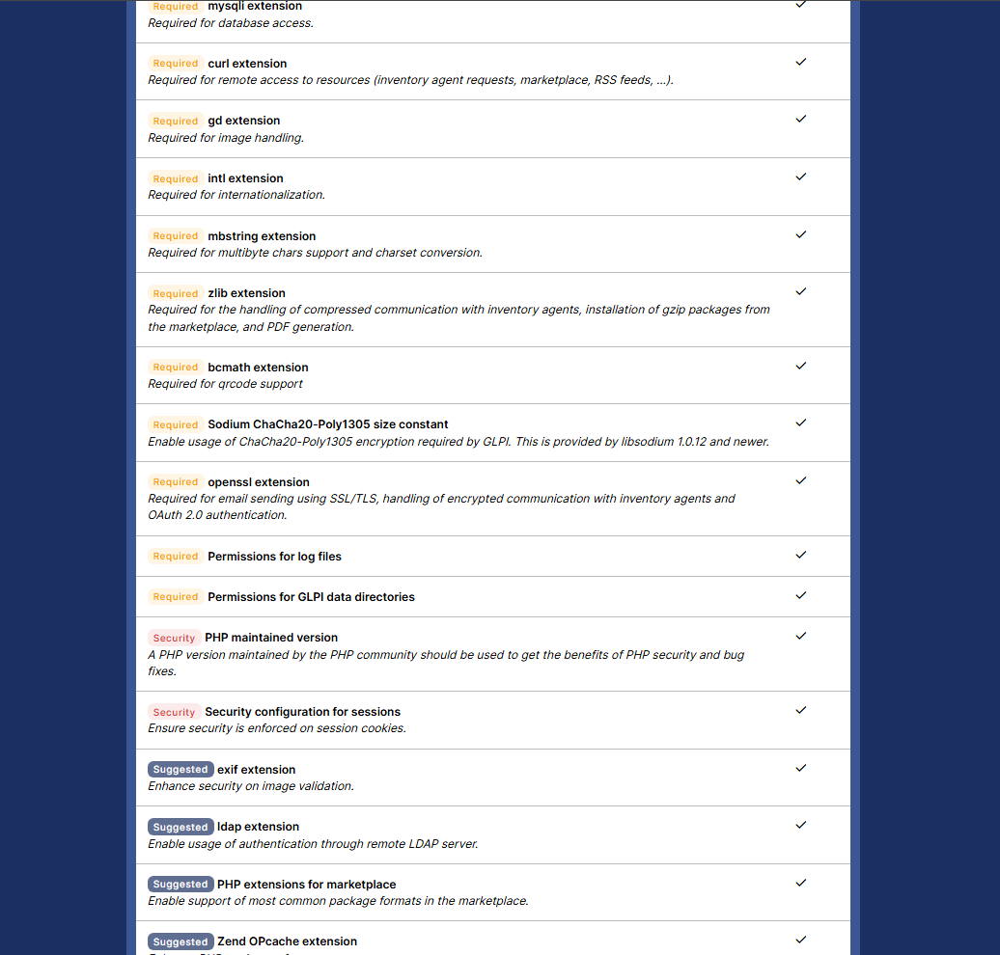
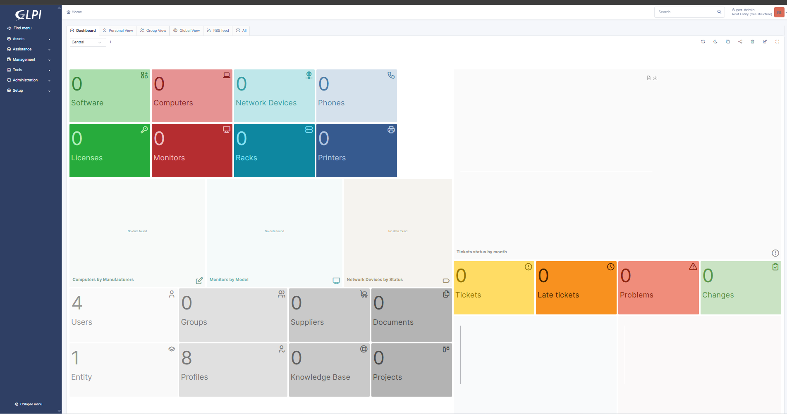
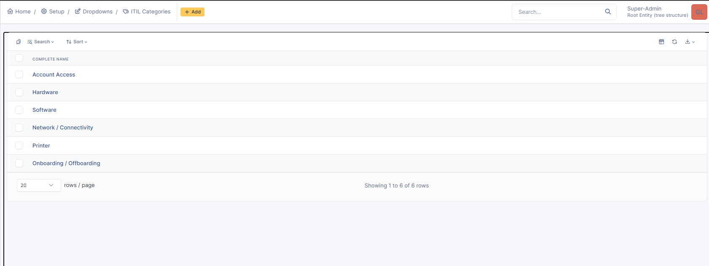
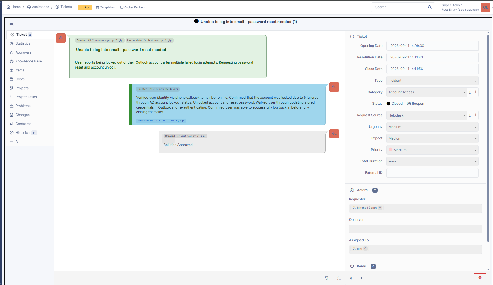
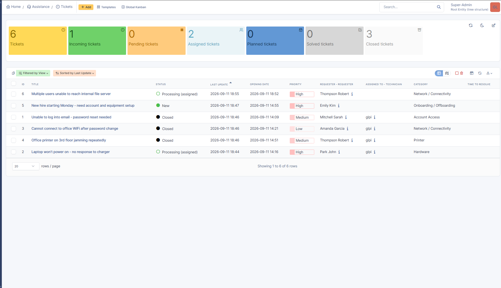
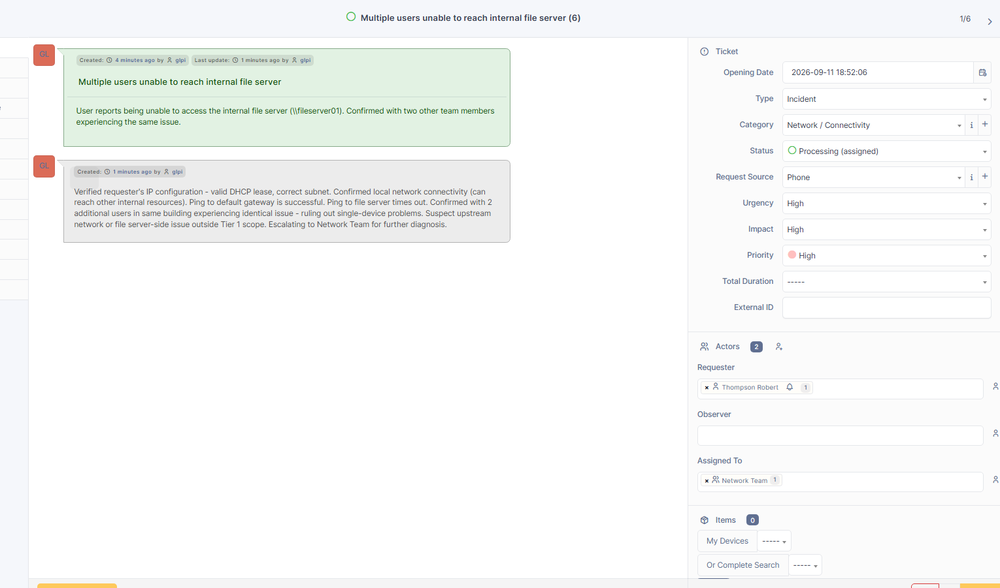
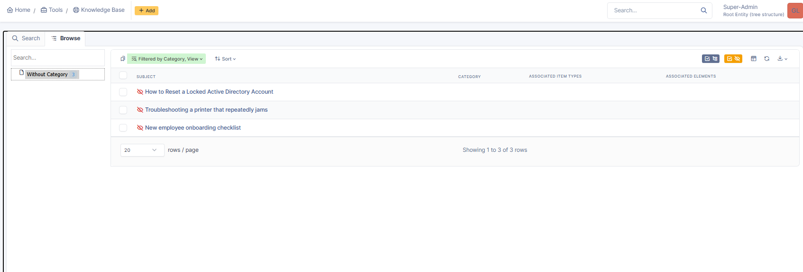
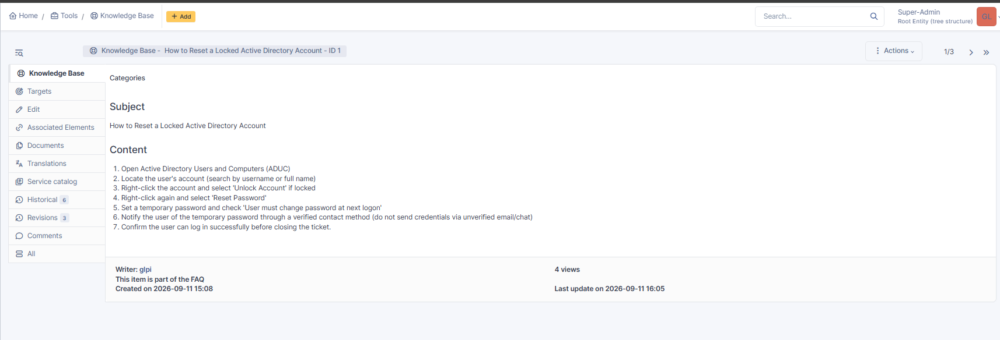
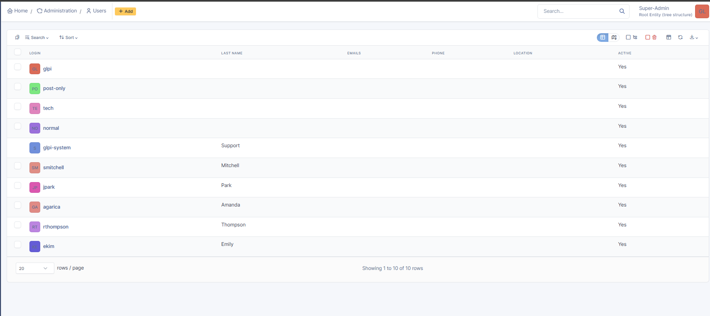

# IT Help Desk Ticket Simulation

A self-hosted GLPI deployment demonstrating ticket triage, resolution documentation, and knowledge base crafting.

## Environment 

- **Platform:** GLPI 11.0.8 (open-source IT Service Management software)
- **Host:** Debian 12 LXC container on Proxmox VE
- **Backend:** Apache 2.4, MariaDB 10.11, PHP 8.2
- **Deployment:** Self-hosted on existing home lab infrastructure

Before installing GLPI, I validated the environment against its requirements, catching and resolving a missing PHP extension before proceeding:

*Initial environment check flagged a missing PHP bcmath extension, required for QR code support.*

*Installed php-bcmath and re-ran the check. All required, security, and suggested checks now passing.*

## What I built

- Deployed GLPI from source on purpose-built LXC container, configuring Apache, MariaDB, required PHP extensions.
- Hardened the installation by securing the MariaDB root account, removing default database access, and changing all default GLPI account passwords.

*Fresh GLPI install with demonstration data disabled; clean baseline before populating sample ticket data.*

- Designed six custom ITIL ticket categories reflecting real help desk request types (Account Access, Hardware, Software, Network/Connectivity, Printer, Onboarding/Offboarding).

*Custom ITIL ticket categories configured to reflect common help desk request types.*

- Created and resolved sample tickets across multiple categories and priority levels, each with realistic troubleshooting steps and resolution notes.

*Sample resolved ticket showing identity verification, root cause diagnosis, and remediation steps documented for the user.*

*Full ticket queue showing a realistic mix of statuses, one new, one in progress, three resolved, across: account access, hardware, network, and printer categories.* 

- Built a Tier 1 / Tier 2 Desktop / Network Team group structure and demonstrated proper escalation - diagnosing and ruling out local causes before handing off an issue outside Tier 1 scope. 

*Escalation scenario demonstrating Tier 1 scope - diagnosed and ruled out local causes before escalating to the Network Team for upstream investigation.*

- Authored knowledge base articles documenting standard resolution procedures, directly tied to ticket types handled in the system.

*Knowledge base articles written to document standard resolution procedures for common ticket types; supports faster, consistent troubleshooting.*

*Example KB article. Step-by-step procedure written to standardize resolution of a common ticket type.*

- Managed user accounts and default credential hygiene across the platform.

*user accounts configured. Default system accounts were secured and sample requester profiles created to support realistic ticket scenarios.*

## Skills Demonstrated 

- **Systems administration:** Deployed and configured a Linux server (Apache, MariaDB, PHP) from scratch on a virtualized platform.
- **ITSM platform administration:** Configured GLPI end-to-end; categories, user accounts, permissions, and knowledge base structure.
- **Security hygiene:** Identified and remediated default credentials across database and application accounts before considering the deployment complete.
- **Technical documentation:** Wrote clear, structured resolution notes and knowledge base articles modeling correct procedure for common help desk request types.
-  **IT support process knowledge:** Applied standard best-practice procedures for account lockouts, hardware triage, and onboarding workflows in ticket scenarios.
